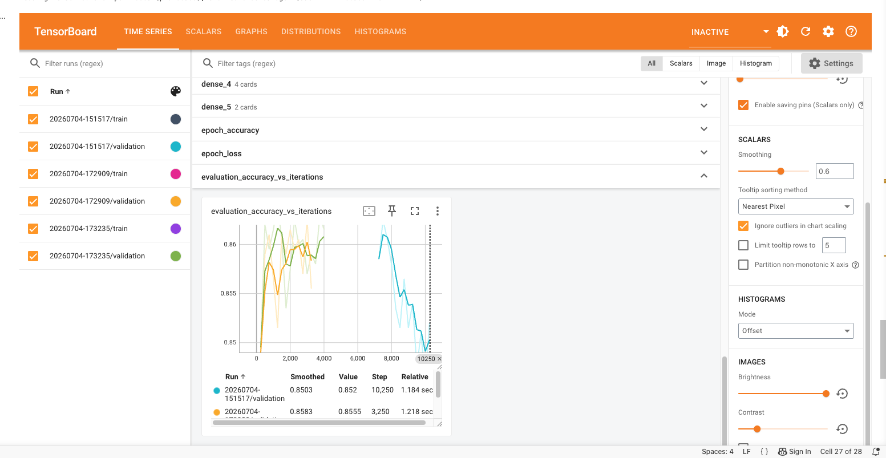
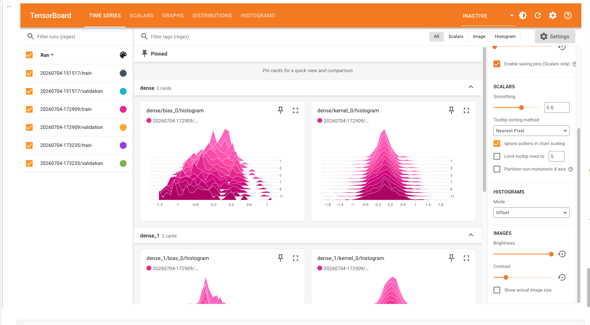
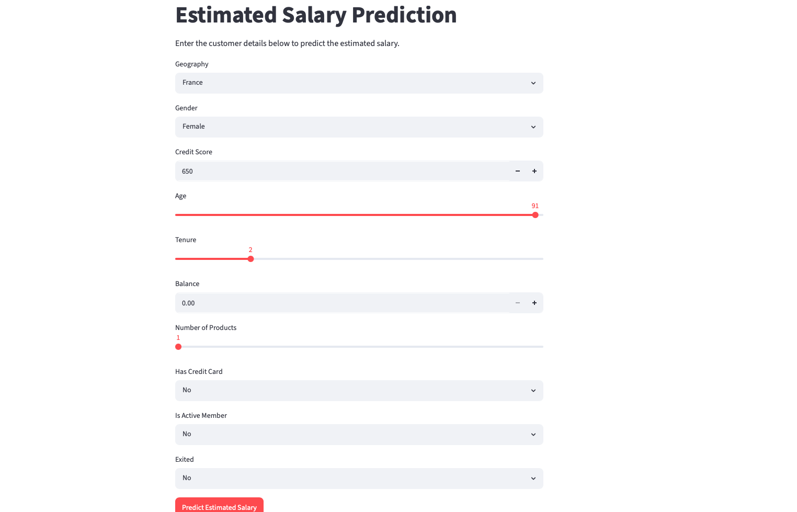
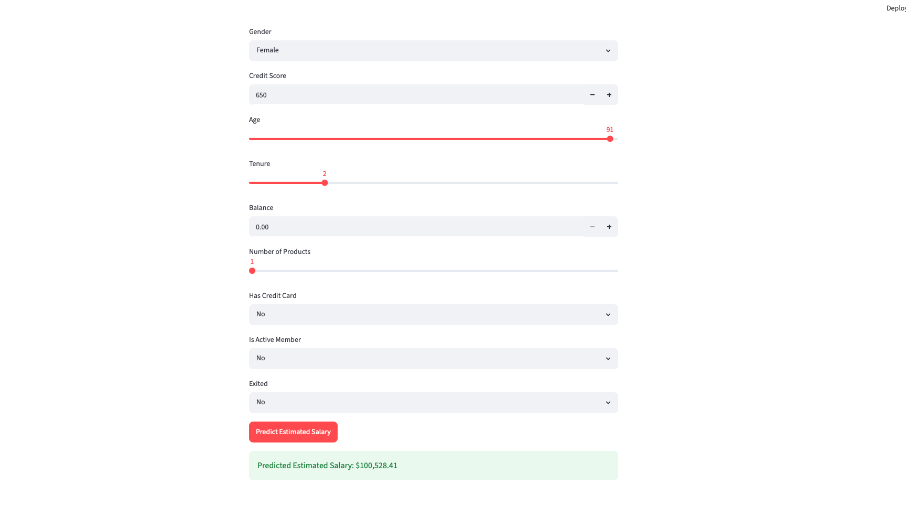

# 🏦 Customer Churn & Estimated Salary Prediction — ANN Projects


---

## 📌 Project Overview

This repository contains **two complete end-to-end Deep Learning projects** built on the same bank customer dataset, using **Artificial Neural Networks (ANN)** with TensorFlow and Keras:

1. **Customer Churn Classification** — predicts whether a customer will leave the bank (`Exited`: 1/0)
2. **Estimated Salary Regression** — predicts a customer's estimated salary (`EstimatedSalary`) as a continuous value

Both models are served through their own interactive **Streamlit web applications**.

> **Business Problem:** Banks lose significant revenue when customers close their accounts, and understanding a customer's likely salary helps with targeted product offers and credit decisions. Both problems are solved here using the same underlying customer feature set.

---

## 🎯 Problem Statements

| Property | Churn Classification | Salary Regression |
|---|---|---|
| **Task** | Binary Classification | Regression |
| **Target** | `Exited` — 1 = Churned, 0 = Stayed | `EstimatedSalary` — continuous value |
| **Dataset** | Churn_Modelling.csv | Churn_Modelling.csv |
| **Rows** | 10,000 customer records | 10,000 customer records |
| **Features** | 12 input features (Exited excluded, EstimatedSalary included) | 12 input features (EstimatedSalary excluded, Exited included) |

---

## 🗂️ Repository Structure

```
├── app.py                        # Streamlit app — Churn Classification
├── salary_app.py                 # Streamlit app — Salary Regression
├── experiments.ipynb             # Data exploration, preprocessing & training — churn model
├── salaryregression.ipynb        # Data exploration, preprocessing & training — salary model
├── prediction.ipynb              # Inference and prediction examples
├── model.h5                      # Saved Keras ANN model — churn classification
├── regression_model.h5           # Saved Keras ANN model — salary regression
├── scaler.pkl                    # Fitted StandardScaler (shared preprocessing artifact)
├── label_encoder_gender.pkl      # Fitted LabelEncoder for Gender column
├── onehot_encoder_geo.pkl        # Fitted OneHotEncoder for Geography column
├── Churn_Modelling.csv           # Raw dataset (10,000 rows)
├── requirements.txt              # Python dependencies
├── assets/                       # README images (TensorBoard screenshots, app UI, etc.)
└── README.md                     # Project documentation
```

> ⚠️ Note: `scaler.pkl`, `label_encoder_gender.pkl`, and `onehot_encoder_geo.pkl` are re-used across both notebooks but are **fit independently in each notebook's pipeline** on that notebook's specific feature set (the churn model excludes `Exited` and includes `EstimatedSalary`; the regression model does the reverse). If running both apps from the same folder, make sure the `.pkl` files present match the app you're currently running, or keep each project in its own folder with its own copies of the artifacts.

---

# Part 1 — Customer Churn Classification

## 📊 Dataset — Features Used

| Feature | Type | Description |
|---|---|---|
| `CreditScore` | Numerical | Customer's credit score (300–900) |
| `Geography` | Categorical | Country: France, Germany, Spain |
| `Gender` | Categorical | Male / Female |
| `Age` | Numerical | Customer age (18–92) |
| `Tenure` | Numerical | Years as a bank customer (0–10) |
| `Balance` | Numerical | Account balance |
| `NumOfProducts` | Numerical | Number of bank products used (1–4) |
| `HasCrCard` | Binary | Has credit card: 0 / 1 |
| `IsActiveMember` | Binary | Is active member: 0 / 1 |
| `EstimatedSalary` | Numerical | Annual estimated salary |
| **`Exited`** | **Target** | **Churned: 1 · Stayed: 0** |

> Columns dropped before training: `RowNumber`, `CustomerId`, `Surname` (irrelevant identifiers)

## 🧹 Data Preprocessing Pipeline

Three preprocessing steps are applied and saved as artifacts to ensure **identical transformation at inference time**:

### 1. Label Encoding — Gender
```python
from sklearn.preprocessing import LabelEncoder
le = LabelEncoder()
df['Gender'] = le.fit_transform(df['Gender'])
# Female → 0,  Male → 1
```

### 2. One-Hot Encoding — Geography
```python
from sklearn.preprocessing import OneHotEncoder
ohe = OneHotEncoder(sparse_output=False)
geo_encoded = ohe.fit_transform(df[['Geography']])
# France → [1,0,0], Germany → [0,1,0], Spain → [0,0,1]
```

### 3. Feature Scaling — StandardScaler
```python
from sklearn.preprocessing import StandardScaler
sc = StandardScaler()
X_train = sc.fit_transform(X_train)
X_test  = sc.transform(X_test)      # fit only on train → prevent data leakage
```

> ⚠️ **Important:** The scaler is fitted **only on the training set**. The same fitted scaler is then applied to both test data and new user inputs. This prevents data leakage.

## 🧠 Model Architecture — ANN (Sequential)

```
┌──────────────────────────────┬────────────────────┬─────────┐
│ Layer (type)                 │ Output Shape       │  Params │
├──────────────────────────────┼────────────────────┼─────────┤
│ dense_2  (Dense — ReLU)      │ (None, 64)         │     832 │
│ dense_3  (Dense — ReLU)      │ (None, 32)         │   2,080 │
│ dense_4  (Dense — Sigmoid)   │ (None, 1)          │      33 │
└──────────────────────────────┴────────────────────┴─────────┘
  Total Trainable Parameters: 2,945
```

### Compilation
```python
model.compile(
    optimizer = 'adam',
    loss      = 'binary_crossentropy',
    metrics   = ['accuracy']
)
```

| Hyperparameter | Value | Reason |
|---|---|---|
| Activation (hidden) | ReLU | Fast convergence, avoids vanishing gradient |
| Activation (output) | Sigmoid | Outputs probability between 0 and 1 |
| Optimizer | Adam | Adaptive learning rate, works well out of the box |
| Loss | Binary Crossentropy | Standard loss for binary classification |
| Epochs | 100 | Sufficient for convergence on this dataset size |
| Batch Size | 32 | Good balance of speed and gradient stability |

## 📈 Training — TensorBoard Visualization

```python
import datetime
from tensorflow.keras.callbacks import TensorBoard

log_dir = 'logs/fit/' + datetime.datetime.now().strftime('%Y%m%d-%H%M%S')
tb_callback = TensorBoard(log_dir=log_dir, histogram_freq=1)

model.fit(
    X_train, y_train,
    epochs          = 100,
    batch_size      = 32,
    validation_data = (X_test, y_test),
    callbacks       = [tb_callback]
)
```

**To launch TensorBoard locally:**
```bash
tensorboard --logdir logs/fit
```
Then open `http://localhost:6006` in your browser.

### Evaluation Accuracy Across Training Runs



Three separate training runs (`151517`, `172909`, `173235`) are compared side by side. All runs climb quickly to roughly **0.86 accuracy** within the first 2,000–4,000 steps, then begin to drift downward and get noisier as training continues to 10,000+ steps — a sign that the model passes its best generalization point early and starts overfitting on later epochs.

### Weight & Bias Histograms



The `dense/kernel_0` and `dense/bias_0` histograms show how the first layer's weights and biases evolve over training, layered by step. The distributions stay roughly bell-shaped and centered near zero without runaway growth in either direction, indicating stable training with no exploding-weight issues.

## 📊 Model Results — Actual Evaluation on Test Set

Evaluated on **2,000 held-out records** (20% of the dataset, random_state=42):

| Metric | Value |
|---|---|
| **Test Accuracy** | **86.05%** |
| **Test Loss** | 0.3469 |
| **Precision (Churned)** | 0.74 |
| **Recall (Churned)** | 0.44 |
| **F1-Score (Churned)** | 0.56 |
| **Precision (Not Churned)** | 0.88 |
| **Recall (Not Churned)** | 0.96 |
| **F1-Score (Not Churned)** | 0.92 |

### Classification Report
```
              precision    recall  f1-score   support

 Not Churned       0.88      0.96      0.92      1607
     Churned       0.74      0.44      0.56       393

    accuracy                           0.86      2000
   macro avg       0.81      0.70      0.74      2000
weighted avg       0.85      0.86      0.85      2000
```

### Confusion Matrix
```
                  Predicted: Stay    Predicted: Churn
Actual: Stay           1547                  60
Actual: Churn           219                 174
```

### Results Interpretation
- The model achieves **86% overall accuracy** on unseen data.
- It correctly identifies **96% of loyal customers** (high recall for Not Churned) — preventing unnecessary retention campaigns.
- **Recall for churned customers is 44%** — meaning the model catches roughly 4 in 10 at-risk customers. This is expected behavior for an imbalanced dataset (20% churn rate) without oversampling.
- **Potential improvement:** Applying SMOTE (Synthetic Minority Oversampling) or adjusting the classification threshold from 0.5 to ~0.3 would increase churn recall at the cost of more false positives.

## 🌐 Streamlit App — `app.py`

The web app loads all saved artifacts and provides a real-time prediction interface:

1. User selects inputs via sliders and dropdowns
2. App applies the **same preprocessing** as training (encode → one-hot → scale)
3. Scaled input is passed to the Keras model
4. Churn probability (0.0 – 1.0) is displayed with a clear verdict

### App UI Inputs
| Input | Widget | Range / Options |
|---|---|---|
| Geography | Selectbox | France · Germany · Spain |
| Gender | Selectbox | Female · Male |
| Age | Slider | 18 – 92 |
| Balance | Number Input | 0.00 – any |
| Credit Score | Number Input | 300 – 900 |
| Estimated Salary | Number Input | 0.00 – any |
| Tenure | Slider | 0 – 10 years |
| Number of Products | Slider | 1 – 4 |
| Has Credit Card | Selectbox | 0 · 1 |
| Is Active Member | Selectbox | 0 · 1 |

---

# Part 2 — Estimated Salary Regression

## 📊 Dataset — Features Used

The regression model reuses the same customer dataset, but flips which column is the target: `EstimatedSalary` becomes the value to predict, and `Exited` (churn status) becomes an **input feature** instead.

| Feature | Type | Description |
|---|---|---|
| `CreditScore` | Numerical | Customer's credit score (300–900) |
| `Geography` | Categorical | Country: France, Germany, Spain |
| `Gender` | Categorical | Male / Female |
| `Age` | Numerical | Customer age (18–92) |
| `Tenure` | Numerical | Years as a bank customer (0–10) |
| `Balance` | Numerical | Account balance |
| `NumOfProducts` | Numerical | Number of bank products used (1–4) |
| `HasCrCard` | Binary | Has credit card: 0 / 1 |
| `IsActiveMember` | Binary | Is active member: 0 / 1 |
| `Exited` | Binary | Whether the customer churned: 0 / 1 |
| **`EstimatedSalary`** | **Target** | **Continuous — the value being predicted** |

## 🧹 Data Preprocessing Pipeline

Identical approach to the churn model — Label Encoding for Gender, One-Hot Encoding for Geography, and StandardScaler for all numeric features — but fit on the regression feature set (dropping `EstimatedSalary` from `X` instead of `Exited`):

```python
data = data.drop(['RowNumber', 'CustomerId', 'Surname'], axis=1)

label_encoder_gender = LabelEncoder()
data['Gender'] = label_encoder_gender.fit_transform(data['Gender'])

onehot_encoder_geo = OneHotEncoder(handle_unknown='ignore')
geo_encoded = onehot_encoder_geo.fit_transform(data[['Geography']]).toarray()
geo_encoded_df = pd.DataFrame(geo_encoded, columns=onehot_encoder_geo.get_feature_names_out(['Geography']))
data = pd.concat([data.drop('Geography', axis=1), geo_encoded_df], axis=1)

X = data.drop('EstimatedSalary', axis=1)
y = data['EstimatedSalary']

X_train, X_test, y_train, y_test = train_test_split(X, y, test_size=0.2, random_state=42)

scaler = StandardScaler()
X_train = scaler.fit_transform(X_train)
X_test  = scaler.transform(X_test)
```

## 🧠 Model Architecture — ANN (Sequential)

```
Model: "sequential"
_________________________________________________________________
 Layer (type)                Output Shape              Param #
=================================================================
 dense (Dense)               (None, 64)                832
 dense_1 (Dense)             (None, 32)                2080
 dense_2 (Dense)             (None, 1)                 33
=================================================================
Total params: 2945 (11.50 KB)
Trainable params: 2945 (11.50 KB)
Non-trainable params: 0 (0.00 Byte)
```

### Compilation
```python
model = Sequential([
    Dense(64, activation='relu', input_shape=(X_train.shape[1],)),
    Dense(32, activation='relu'),
    Dense(1)  # Linear output for regression — no activation
])

model.compile(optimizer='adam', loss='mean_absolute_error', metrics=['mae'])
```

| Hyperparameter | Value | Reason |
|---|---|---|
| Activation (hidden) | ReLU | Fast convergence, avoids vanishing gradient |
| Activation (output) | None (linear) | Regression needs an unbounded continuous output |
| Optimizer | Adam | Adaptive learning rate, works well out of the box |
| Loss | Mean Absolute Error (MAE) | Directly interpretable in salary units (dollars) |
| Epochs | Up to 100 | Capped by early stopping |
| Callbacks | EarlyStopping + TensorBoard | Stops training once validation loss plateaus |

## 📈 Training — Early Stopping & TensorBoard

```python
from tensorflow.keras.callbacks import EarlyStopping, TensorBoard
import datetime

log_dir = "regressionlogs/fit/" + datetime.datetime.now().strftime("%Y%m%d-%H%M%S")
tensorboard_callback = TensorBoard(log_dir=log_dir, histogram_freq=1)

early_stopping_callback = EarlyStopping(monitor='val_loss', patience=10, restore_best_weights=True)

history = model.fit(
    X_train, y_train,
    validation_data=(X_test, y_test),
    epochs=100,
    callbacks=[early_stopping_callback, tensorboard_callback]
)
```

**To launch TensorBoard locally:**
```bash
tensorboard --logdir regressionlogs/fit
```

### Training Results

Training ran for **74 epochs** before `EarlyStopping` (patience=10, monitoring `val_loss`) halted it and restored the best weights:

| Stage | Loss (MAE) | Val Loss (MAE) |
|---|---|---|
| Epoch 1 | 100,368.30 | 98,485.17 |
| Epoch 10 | 51,720.35 | 51,403.63 |
| Epoch 30 | 49,693.18 | 50,341.61 |
| Epoch 52 (best val_loss) | 49,455.33 | **50,247.08** |
| Epoch 74 (stopped) | 49,355.77 | 50,253.31 |

### Results Interpretation
- Loss drops sharply in the first ~10 epochs, from an MAE of over 100K down to roughly 51K, then improves slowly and plateaus around a **validation MAE of ~50,250** (in dollars — since the loss function is MAE directly on salary).
- This means the model's salary predictions are, on average, off by about **$50,000** — a fairly wide margin given salaries in this dataset range from roughly $0 to $200,000.
- This is expected: `EstimatedSalary` in this dataset appears to be close to **randomly assigned** relative to the other features (a known characteristic of this classic Kaggle churn dataset), so there's limited real signal for a model to learn from. The plateau isn't a sign of a broken pipeline — it reflects the ceiling of predictability given these inputs.
- **Potential improvements:** feature engineering (e.g., interaction terms), trying a shallower or regularized model to reduce noise-fitting, or clearly caveating in any downstream use that salary predictions from this dataset carry high uncertainty.

## 🌐 Streamlit App — `salary_app.py`

```python
@st.cache_resource
def load_artifacts():
    model = tf.keras.models.load_model("regression_model.h5")
    with open("label_encoder_gender.pkl", "rb") as file:
        label_encoder_gender = pickle.load(file)
    with open("onehot_encoder_geo.pkl", "rb") as file:
        onehot_encoder_geo = pickle.load(file)
    with open("scaler.pkl", "rb") as file:
        scaler = pickle.load(file)
    return model, label_encoder_gender, onehot_encoder_geo, scaler
```

Unlike `app.py`, this app adds an **`Exited`** selectbox as an input (since churn status is now a predictor rather than the target) and outputs a **dollar-formatted salary prediction** instead of a probability.

### App UI Inputs
| Input | Widget | Range / Options |
|---|---|---|
| Geography | Selectbox | France · Germany · Spain |
| Gender | Selectbox | Female · Male |
| Credit Score | Number Input | 300 – 900 |
| Age | Slider | 18 – 92 |
| Tenure | Slider | 0 – 10 years |
| Balance | Number Input | 0.00 – any |
| Number of Products | Slider | 1 – 4 |
| Has Credit Card | Selectbox | Yes / No |
| Is Active Member | Selectbox | Yes / No |
| Exited | Selectbox | Yes / No |

### App Screenshots



The app takes the same core customer profile inputs as the churn app, plus an `Exited` field, and returns a dollar-formatted prediction (e.g., *"Predicted Estimated Salary: $XX,XXX.XX"*) after clicking **Predict Estimated Salary**.



Example run: for a 91-year-old female customer with a 650 credit score, 2 years tenure, $0 balance, 1 product, no credit card, not an active member, and not churned, the model predicts an **estimated salary of $100,528.41**.

---

## 🚀 Running the Projects Locally

### Prerequisites
- Python 3.11
- Git

### Installation

```bash
# 1. Clone the repository
git clone https://github.com/YOUR_USERNAME/ann-customer-churn-prediction.git
cd ann-customer-churn-prediction

# 2. Create a virtual environment
python -m venv venv
source venv/bin/activate        # Windows: venv\Scripts\activate

# 3. Install dependencies
pip install -r requirements.txt

# 4a. Launch the churn classification app
streamlit run app.py

# 4b. Launch the salary regression app (in a separate terminal / environment)
streamlit run salary_app.py
```

Each app opens automatically at `http://localhost:8501` (Streamlit will auto-increment the port if one is already running).

### requirements.txt
```
tensorflow==2.15.0
pandas
numpy
scikit-learn
tensorboard
matplotlib
streamlit
```

> **Note:** TensorFlow 2.15.0 is pinned to ensure compatibility between the saved `.h5` models and the serving environment.

---

## ☁️ Deployment — Streamlit Cloud

Both apps can be deployed independently via **Streamlit Community Cloud** (free tier):

1. Push the entire repository to **GitHub** (all files including `.pkl`, `.h5`, `requirements.txt`)
2. Go to [share.streamlit.io](https://share.streamlit.io) → Sign in with GitHub
3. Click **"New app"** → Select your repo → Set `app.py` (churn) or `salary_app.py` (salary) as the main file
4. Click **Deploy** — Streamlit Cloud auto-installs dependencies and serves the app

---

## 🛠️ Tech Stack

| Component | Technology |
|---|---|
| Deep Learning Framework | TensorFlow 2.15.0 + Keras |
| Preprocessing | scikit-learn (LabelEncoder, OneHotEncoder, StandardScaler) |
| Data Manipulation | pandas, NumPy |
| Model Persistence | Keras `.h5` + Python Pickle |
| Visualization | TensorBoard, Matplotlib |
| Web Application | Streamlit |
| Deployment | Streamlit Community Cloud |
| Language | Python 3.11 |

---

## 🔑 Key Concepts Demonstrated

| Concept | Implementation |
|---|---|
| **Binary Classification** | Sigmoid output + Binary Crossentropy loss (churn model) |
| **Regression** | Linear output + MAE loss (salary model) |
| **Feature Engineering** | Label Encoding, One-Hot Encoding, Standardization |
| **Data Leakage Prevention** | Scaler fitted on train set only, applied to test/inference |
| **Preprocessing Persistence** | Encoders + scaler saved with Pickle, reloaded at inference |
| **Model Persistence** | Keras `.h5` format, reloaded with `tf.keras.models.load_model` |
| **Training Monitoring** | TensorBoard callbacks → loss/accuracy curves |
| **Early Stopping** | `EarlyStopping(monitor='val_loss', patience=10, restore_best_weights=True)` on the regression model |
| **Deployment** | Streamlit apps served on Streamlit Community Cloud |
| **End-to-End Pipeline** | Raw CSV → preprocessing → training → saving → web app → cloud |

---

## 🎓 Interview Q&A — Key Concepts

**Q1: Why did you use an ANN instead of a traditional ML model like Logistic Regression, Linear Regression, or XGBoost?**

> ANNs can automatically learn non-linear feature interactions without manual feature engineering. For tabular data at this scale (10K rows, ~12 features), an ANN with 2 hidden layers is a good starting point that demonstrates deep learning concepts while still being lightweight and fast to train. However, for purely tabular data, tree-based models like XGBoost often outperform ANNs — these projects focus on demonstrating the full DL workflow rather than optimizing benchmark accuracy.

**Q2: What preprocessing steps did you apply and why?**

> Three steps, shared across both models: (1) **Label Encoding** for Gender — binary categorical, no ordinality issue; (2) **One-Hot Encoding** for Geography — 3 categories with no ordinal relationship, so one-hot avoids implying France < Germany < Spain; (3) **StandardScaler** — brings all features to mean=0, std=1, since neural networks are sensitive to feature magnitude differences (e.g., Balance in the 0–250K range would otherwise dominate Tenure in the 0–10 range).

**Q3: How did you prevent data leakage with the scaler?**

> The StandardScaler is fitted **only on the training set** using `fit_transform()`. The test set and new user inputs use only `transform()`. All fitted preprocessing objects are saved with Pickle and reloaded in the Streamlit apps to apply the exact same transformation to new inputs.

**Q4: Why is churn recall only 44%? Is that a problem?**

> The dataset is imbalanced — only 20.4% of customers churned. Without handling imbalance, the model learns to predict "Not Churned" more often since that minimizes loss. Potential fixes: SMOTE oversampling, `class_weight` in `model.fit()`, or lowering the classification threshold from 0.5 to 0.3–0.4 (at the cost of more false positives).

**Q5: Why does the regression model use MAE loss instead of MSE?**

> MAE is directly interpretable in the target's original units (dollars), and it's more robust to outliers than MSE, which squares errors and can be dominated by a few large mistakes. Since the goal here is an intuitive "average dollar error," MAE was the natural choice, and it doubles as both the loss and the tracked metric.

**Q6: Why does the salary model plateau at ~$50K MAE — is that a bug?**

> No — this reflects a real limitation of the dataset. `EstimatedSalary` in this classic dataset is close to randomly distributed relative to the other features, so there's limited genuine signal to learn from. The steep initial drop (100K → ~50K MAE) shows the model quickly captures what structure exists, and the plateau after that shows it hitting the noise floor rather than a training or code issue.

**Q7: Why did you use EarlyStopping for the regression model but not (explicitly) for the classification model?**

> The regression notebook adds `EarlyStopping(monitor='val_loss', patience=10, restore_best_weights=True)`, which halts training once validation loss stops improving for 10 consecutive epochs and restores the best-performing weights — useful here since validation loss plateaus early. The classification model was trained for a fixed 100 epochs without this callback, which the accuracy chart shows leads to overfitting past its peak; adding the same `EarlyStopping` callback there is a natural improvement (see the TensorBoard accuracy discussion above).

**Q8: What does the Sigmoid vs. linear (no activation) output layer mean for each model?**

> Sigmoid (churn model) maps any real number to (0, 1), interpretable as a probability, with 0.5 as the classification threshold. A linear/no-activation output (salary model) leaves the value unbounded, which is required for regression since salary can be any positive real number, not a probability.

**Q9: How do the two Streamlit apps differ in their input handling?**

> `app.py` treats `Exited` as the value to predict, so it isn't collected as an input, and instead collects `EstimatedSalary` as an input feature. `salary_app.py` does the reverse: it collects `Exited` as a Yes/No input and predicts `EstimatedSalary` as a dollar output. Both apply the same encoder/scaler-loading pattern before calling `model.predict()`.

**Q10: How would you improve these projects further?**

> - **Churn model:** address class imbalance (SMOTE, class weights, threshold tuning), add `EarlyStopping` and `Dropout` to reduce the overfitting seen in the TensorBoard accuracy chart
> - **Salary model:** try non-linear tree-based baselines (XGBoost, LightGBM) to check whether the ~$50K MAE floor is dataset noise or a modeling gap; add feature interactions
> - **Both:** hyperparameter tuning with Keras Tuner, experiment tracking (MLflow / Weights & Biases), and wrapping both models behind a shared FastAPI endpoint for programmatic access alongside the Streamlit UIs

---

## 📦 Project Learnings

| Skill | How It Was Applied |
|---|---|
| Pandas / NumPy | Data loading, cleaning, feature selection, DataFrame manipulation |
| scikit-learn Preprocessing | LabelEncoder, OneHotEncoder, StandardScaler, train_test_split |
| Keras Sequential API | Building, compiling, training, evaluating both ANN models |
| Callbacks — TensorBoard & EarlyStopping | Logging training metrics; halting regression training at the right point |
| Pickle | Serializing and deserializing sklearn objects |
| Keras `.save()` / `load_model()` | Persisting and restoring trained neural networks |
| Streamlit | Building two independent interactive web UIs in pure Python |
| Streamlit Cloud | Free cloud deployment directly from a GitHub repository |
| Inference pipeline | Applying training-time preprocessing to new, unseen inputs for both classification and regression |

---

## 📬 Contact

**Sai Krishna Reddy Ragula**
Software Engineer — American Express | Deep Learning & NLP Enthusiast

🔗 [LinkedIn](https://www.linkedin.com/in/saikrishnareddyragula)
🐙 [GitHub](https://github.com/saikrishnareddy1731)

---

## 📝 License

This project is open-source under the [MIT License](LICENSE).
